<h1>Compte Rendu</h1>
<h2 style="color: red">PhpMyAdmin :</h2>

<h2 style="color: green">Exécution :</h2>
<h2 style="color: red">Interface des scripts :</h2>
<h2 style="color: green">Si le client est un Admin :</h2>
<h3>Après le client va cliquer sur Login pour s’authentifier et se connecter :</h3>
<h3 style="color: blueviolet">Exemple :</h3>
<h3>Login : mohamed</h3>
<h3>Password : 1234</h3>

<h3>Après son authentification, l’administrateur, pourra accéder à un menu qui nous permet d’accéder à la liste suivante : Home, Patients, Logout.</h3>
<h3>Le Logout c’est pour se déconnecter</h3>
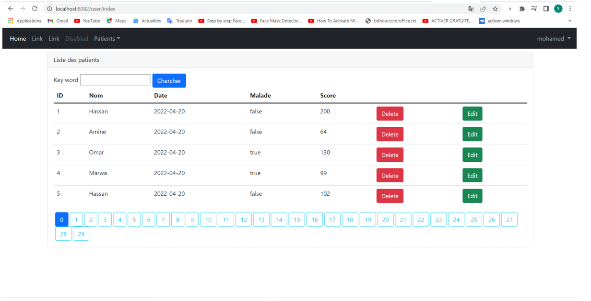
<h3>l’administrateur permet de faire :</h3>
<h2 style="color: green">La Recherche des patients et pagination :</h2>
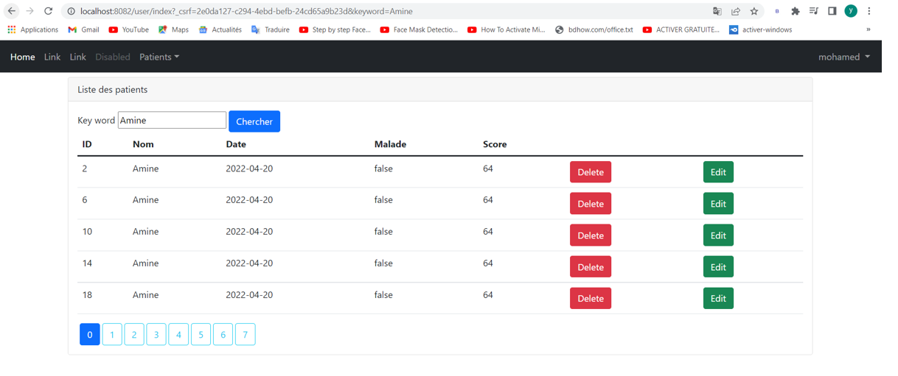
<h2 style="color: green">La Suppression des patients :</h2>
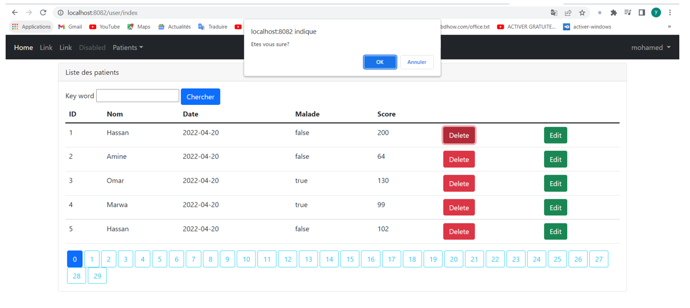
<h2 style="color: green">L’Ajout des patients :</h2>
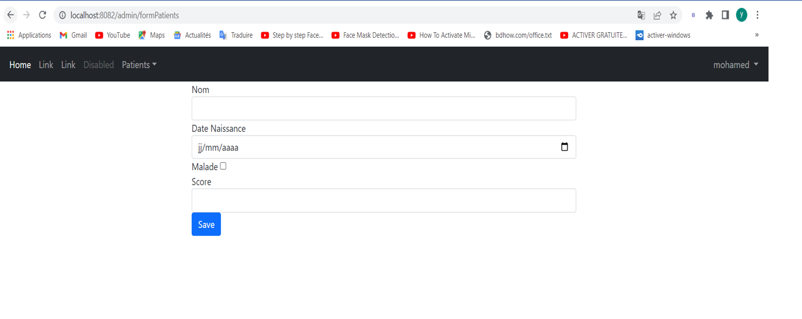
<h3> Si le formulaire est vide ou une case du formulaire est vide , il va nous afficher les consignes suivantes :</h3>
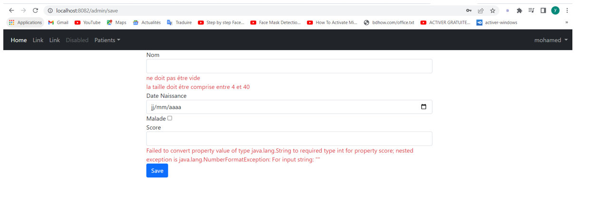
<h3>Editer les patients et modifier leur informations :</h3>
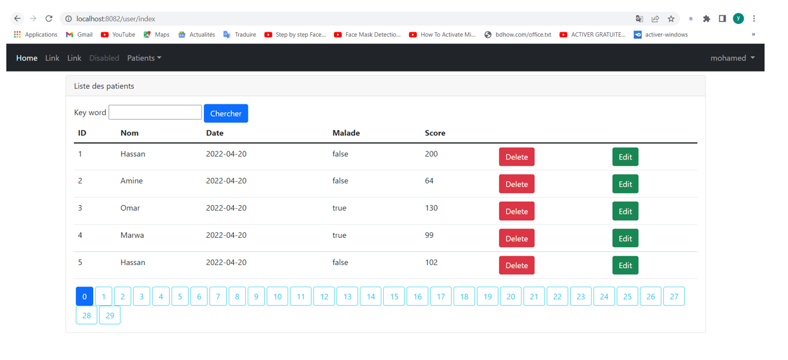
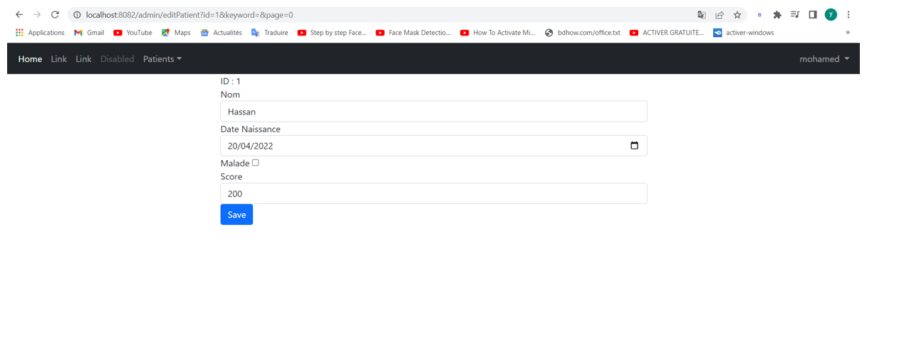
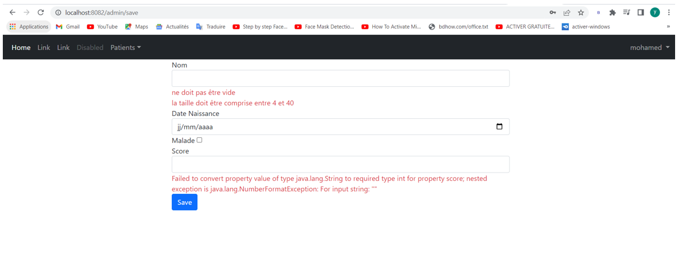

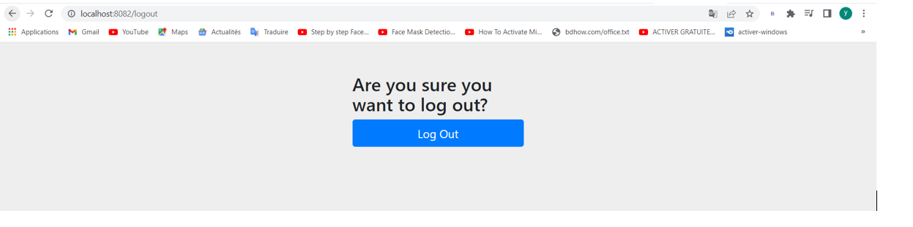
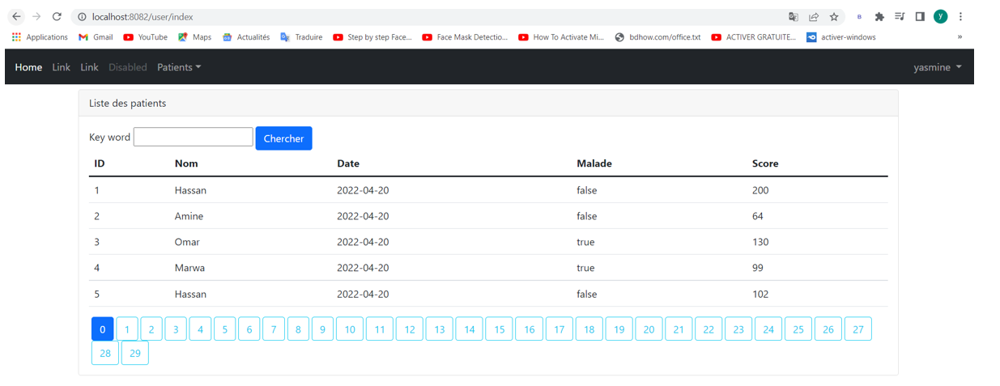
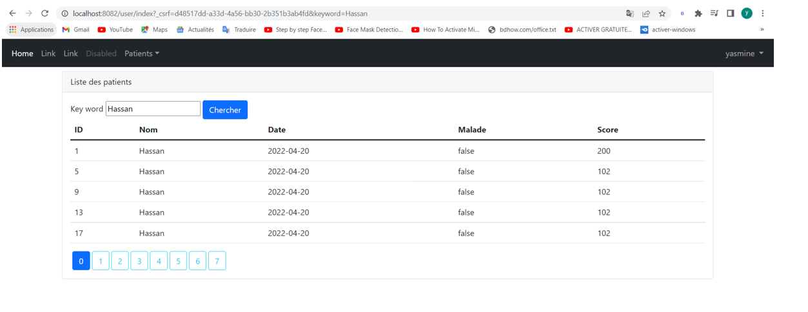